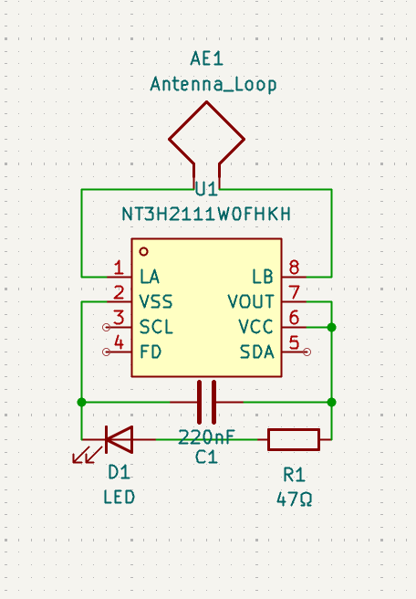
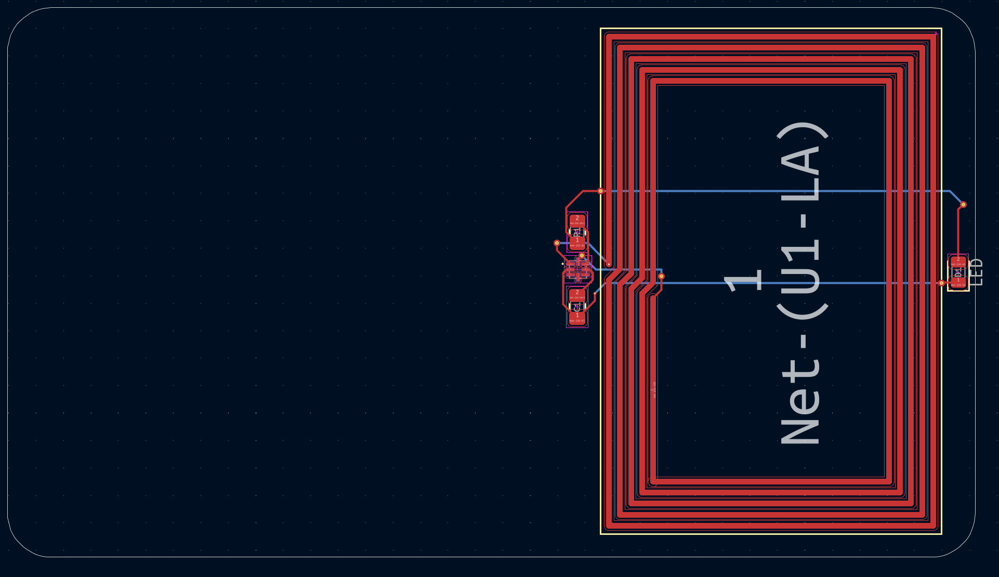

# July 23rd: Schematic

- Got Mainboard, LED, Resistor, Capacitor, and Antenna (was a pain to find).
- Wired together
- idk what else to put

**Total time spent: ~1 hour**

# July 24th: PCB and Custom Silkscreen

- Wired everything together
- Created an edge cut
- Also added small hole to put the card on a keychain (not in the image)
- Added cool silkscreen images like Hack Club Logo, Github Logo, Autodesk and Onshape, narpy, GitLnes, etc.

- Created Gerber Files, Zipped, and uploaded to repo
**Total time spent: ~2 hours**